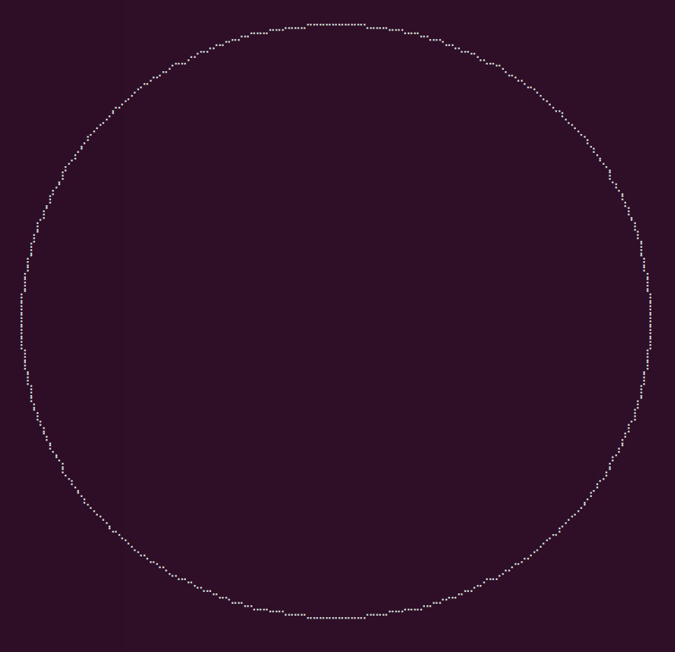
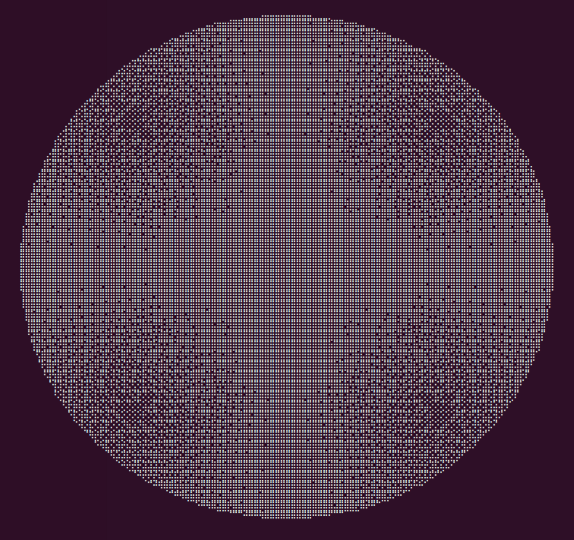

# blessed-circle

:art: Draw a circle or a disk in your terminal using [blessed](https://github.com/chjj/blessed).




## Install

```
npm i -S blessed-circle
```

You also need to have blessed installed locally as it's a peerDependency.

## Usage

```javascript
const Circle = require('blessed-circle');
// Create blessed screen
const screen = blessed.screen();

const circle = new Circle({
  top      : 'center',
  left     : 'center',
  diameter : 100,
  color    : 'white',
});

// Disk
const disk = new Circle({
  top      : 'center',
  left     : 'center',
  diameter : 100,
  color    : 'white',
  fill     : true,
});
```

## API

- ```new Circle(opts)```
  - ```diameter``` : circle size
  - ```color```    : circle color
  - ```fill```     : flag to draw a disk instead of a circle
  - All ```blessed.Element``` [properties](https://github.com/chjj/blessed#element-from-node)


## Credits

- [blessed](https://github.com/chjj/blessed)
- [blessed-contrib](https://github.com/yaronn/blessed-contrib#donut) and its donut widget
